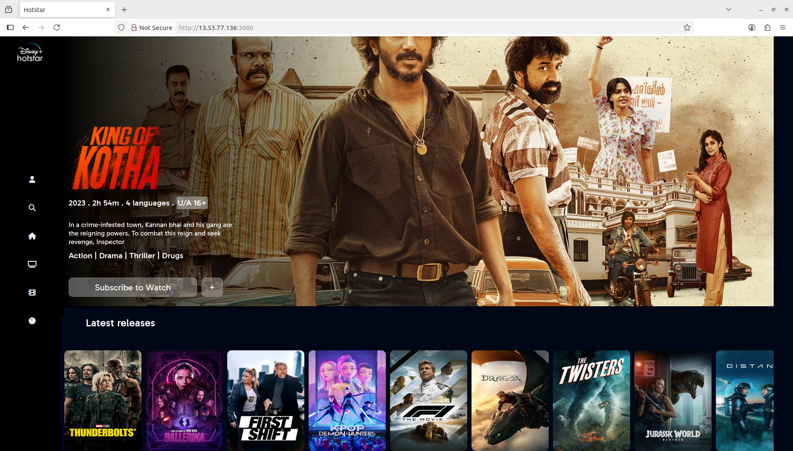

# **DevOps Project: Disney Hotstar clone app Deployment on docker**

In this **DevOps project**, I demonstrate how to **deploy a ZOMATO Clone App** using a variety of modern DevOps tools and services.

## **Phase 1: Initial setup and Deployment**

**Step 1: Launch EC2 (ubuntu 22.04)**

- Provision an EC2 instance on AWS with Ubuntu 22.04, t3x.large, storage= 30gb.
- Allow ports 
   - SSH 22
   - HTTP 80
   - HTTPS 443
   - TCP 8080
   - TCP 587
   - TCP 465
   - TCP 3000 
   - TCP 9000

- Set the **Source** to **anywhere**

- Connect the Instance using SSH.

**Step 2: Update the package**

```bash
sudo apt-get update
```

**step 3: Clone the Repository**

```bash
git clone https://github.com/didin8080/Disney-hotstar-project.git
```

**step 4: Go inside the directory**

```bash
cd Devops-project-hotstar
```
```bash
cd scripts
```
```bash
ll
```

**step 5: Add Executable Permission to shell scripts**

```bash
sudo chmod +x *.sh
```
(*) it provides all the shell scripts executable permission

**step 6: Install tools**

```bash
sh jenkins.sh

systemctl status jenkins
```
control+c to come out from this. 

```bash
sh docker.sh
```

Install sonarqube using docker

```bash
docker run -d --name sonar -p 9000:9000 sonarqube:lts-community

docker ps
docker images
```

```bash 
sh trivy.sh

trivy --version
```

**Configure Jenkins and SonarQube**


**Step 7: Install necessary plugins on Jenkins**

Goto Jenkins dashboard--> Manage Jenkins --> Plugins

Install below plugins
- Eclipse temurim installer
- sonarqube scanner
- nodej
- OWASP dependency-check 5.5.1
- docker 1.6.2
- Docker commons
- docker pipeline
- docker api
- docker-build-step
- pipeline:stage view
- promethieus metrics
- email extension template
- Blueocean

Restart when no jobs are running.


**Step 8: Make the repository Private**

Goto github --> select the repository --> goto repo settings --> scrool down--> change visibility to public

Goto github --> acconts--> settings -->Developers settings--> Personal access token--> classic--> create a token with scopes 
 - repo
 - admin:repo_hook
 - admin:org_hook
 - project
 - write:package 


**Step 9: Tools configuration in jenkins**

Goto Jenkins dashboard--> Manage Jenkins --> tools 
- add jdk,give name as jdk17 ,install automatically ,add installer, install from adoptium.net, select jdk-17.0.8.1+1 
- add sonarqube scanner--> name= sonar-scaner,insall automatically,
- add node js--> name=node23 
- add dependency check --> name= DP-Check ,install automatically ,add installer, install from github.com
- add docker --> name=docker,install automatically,add installer ,download from docker.com
- apply and save


**Step 10: ADD Credentials on Jenkins**

- On sonarqube -> admininstration-->security--> user--> rightside 3dots--> give any name --> generate token
- On jenkins --> manage jenkins-->credentials-->global--> add credentials--> kind=secret text --> on secret paste the token and give any name and description-->give any id and description-->create
- On jenkins --> manage jenkins-->credentials-->global--> add credentials-->kind=username with password--> username=give the username of dockerhub--> password=password of dockerhub-->create
- On jenkins --> manage jenkins-->credentials-->global--> add credentials--> kind=username with password--> username=give github username-->Password= token that we created for github private--> id= github-token --> description=github-token

**step 11: System Configuration in Jenkins**

- On jenkins--> manage jenkins--> system--> add sonarqube server -->give name as sonar-server--> on server url= paste the url of sonarqube -->select the authentication --> apply and save .


**step 12: Create webhook in sonarqube**

- on jenkins--> manage jenkins--> system--> add sonarqube server -->give name as sonar-server--> on server url= paste the url of sonarqube with sonarqube-webhook eg:**(192.168.20.173:8080/sonarqube-webhook)** -->select the authentication --> apply and save


**step 13: Create NVD api key**

- Goto google --> type NVD-home --> Developers --> Request an API key --> provide any organization name (eg:didin) --> provide email address --> on organization type = personal use/not listed

- Goto gmail --> you will get an email from nvd --> go inside the mail you will get an link --> go inside the link you will see the api key.


**step 14: Configure CI/CD pipeline in jenkins**

Before pasting the pipeline script, do the following changes in the script
1. In the stage 'Tag and Push to DockerHub', give your docker-hub username. Similar thing you should do in 'DockerScoutImage', 'Deploy to container' stages
2. In post actions stage in pipeline, make sure to give the email id you have configured in jenkins.
3. On github url replace my url with yours 
4. Goto jenkins dashboard → select pipeline → scrolldown select pipeline Syntax --> on sample step --> select git:Git --> paste the repo url --> verify the branch --> on credentials provide credentials --> generate pipeline script --> copy the link and paste it on checkout
5. Replace the NVD api key and paste the key that you create.


```groovy
pipeline{
    agent any
    tools{
        jdk 'jdk17'
        nodejs 'node24'
    }
    environment {
        SCANNER_HOME=tool 'sonar-scanner'
    }
    stages {
        stage('clean workspace'){
            steps{
                cleanWs()
            }
        }
        stage('Checkout from Git'){
            steps{
                git branch: 'main', credentialsId: 'github', url: 'https://github.com/didin8080/Disney-hotstar-project.git'
            }
        }
        stage("Sonarqube Analysis "){
            steps{
                withSonarQubeEnv('sonar-server') {
                    sh ''' $SCANNER_HOME/bin/sonar-scanner -Dsonar.projectName=hotstar \
                    -Dsonar.projectKey=hotstar '''
                }
            }
        }
        stage("quality gate"){
           steps {
                script {
                    waitForQualityGate abortPipeline: false, credentialsId: 'sonar-token' 
                }
            } 
        }
        stage('Install Dependencies') {
            steps {
                sh "npm install"
            }
        }
        stage('OWASP FS SCAN') {
            steps {
                dependencyCheck additionalArguments: '--scan ./ --disableYarnAudit --disableNodeAudit --nvdApiKey d7e8c629-7da9-4f96-8a4a-a45fd3f213ba', odcInstallation: 'DP-Check'
                dependencyCheckPublisher pattern: '**/dependency-check-report.xml'
           }
        }
            stage('TRIVY FS SCAN') {
            steps {
                sh "trivy fs . > trivyfs.txt"
            }
        }
        stage("Docker Build & Push"){
            steps{
                script{
                   withDockerRegistry(credentialsId: 'docker', toolName: 'docker'){   
                       sh "docker build -t hotstar ."
                       sh "docker tag hotstar didin8080/hotstar:latest "
                       sh "docker push didin8080/hotstar:latest "
                    }
                }
            }
        }
        stage("TRIVY"){
            steps{
                sh "trivy image didin8080/hotstar:latest > trivyimage.txt" 
            }
        }
        stage('Deploy to container'){
            steps{
                sh 'docker run -d --name hotstar -p 3000:3000 didin8080/hotstar:latest'
            }
        }

    }
    post {
    always {
        script {
            def buildStatus = currentBuild.currentResult
            def buildUser = currentBuild.getBuildCauses('hudson.model.Cause$UserIdCause')[0]?.userId ?: 'Github User'
            
            emailext (
                subject: "Pipeline ${buildStatus}: ${env.JOB_NAME} #${env.BUILD_NUMBER}",
                body: """
                    <p>This is a Jenkins HOTSTAR CICD pipeline status.</p>
                    <p>Project: ${env.JOB_NAME}</p>
                    <p>Build Number: ${env.BUILD_NUMBER}</p>
                    <p>Build Status: ${buildStatus}</p>
                    <p>Started by: ${buildUser}</p>
                    <p>Build URL: <a href="${env.BUILD_URL}">${env.BUILD_URL}</a></p>
                """,
                to: 'didinpg8080@gmail.com',
                from: 'didinpg8080@gmail.com',
                replyTo: 'didinpg8080@gmail.com',
                mimeType: 'text/html',
                attachmentsPattern: 'trivyfs.txt,trivyimage.txt'
            )
           }
       }

    }

}
```

**BUILT IT.**

**Copy the public ip and paste it in the new tab with port number 3000** 

**You will see the output like this** 

`<public-ip:3000>`


<div align="center">

<p align="center"> Home Page </p>
</div>


**Application is Deployed on Docker** 


## **Phase 2: Moniter the Application**

**step 1: Launch EC2 (ubuntu 22.04)**

- Provision an EC2 instance on AWS Name: Monitoring Server, Ubuntu 24.04, t2.large, Select the SG created in the Step 1, EBS: 30GB.
- Connect to the instance using SSH.

We will install Grafana, Prometheus, Node Exporter in the above instance and then we will monitor it.


**Step 2: Update the packages**

```bash
sudo apt-get update
```
**Step 3: Installing Prometheus**

```bash
sudo useradd --system --no-create-home --shell /bin/false prometheus
wget https://github.com/prometheus/prometheus/releases/download/v2.47.1/prometheus-2.47.1.linux-amd64.tar.gz
#Extract Prometheus files, move them, and create directories:
tar -xvf prometheus-2.47.1.linux-amd64.tar.gz
cd prometheus-2.47.1.linux-amd64/
sudo mkdir -p /data /etc/prometheus
sudo mv prometheus promtool /usr/local/bin/
sudo mv consoles/ console_libraries/ /etc/prometheus/
sudo mv prometheus.yml /etc/prometheus/prometheus.yml
#Set ownership for directories:
sudo chown -R prometheus:prometheus /etc/prometheus/ /data/
```

**Create a systemd unit configuration file for Prometheus:**

```bash
sudo vi /etc/systemd/system/prometheus.service
```

**Add the following content to the prometheus.service file:**

```plaintext
[Unit]
Description=Prometheus
Wants=network-online.target
After=network-online.target

StartLimitIntervalSec=500
StartLimitBurst=5

[Service]
User=prometheus
Group=prometheus
Type=simple
Restart=on-failure
RestartSec=5s
ExecStart=/usr/local/bin/prometheus \
  --config.file=/etc/prometheus/prometheus.yml \
  --storage.tsdb.path=/data \
  --web.console.templates=/etc/prometheus/consoles \
  --web.console.libraries=/etc/prometheus/console_libraries \
  --web.listen-address=0.0.0.0:9090 \
  --web.enable-lifecycle

[Install]
WantedBy=multi-user.target
```

**Enable and start Prometheus:**

```bash
sudo systemctl enable prometheus
sudo systemctl start prometheus
```

**Verify Prometheus's status:**

```bash
sudo systemctl status prometheus
```

Press Control+c to come out


Access Prometheus in browser using your server's IP and port 9090:

`http://<your-server-ip>:9090`

Click on 'Status' dropdown ---> Click on 'Targets' ---> You can see 'Prometheus (1/1 up)'


**Step 4: Installing Node Exporter**

```bash
cd 
sudo useradd --system --no-create-home --shell /bin/false node_exporter
wget https://github.com/prometheus/node_exporter/releases/download/v1.6.1/node_exporter-1.6.1.linux-amd64.tar.gz
#Extract Node Exporter files, move the binary, and clean up:
tar -xvf node_exporter-1.6.1.linux-amd64.tar.gz
sudo mv node_exporter-1.6.1.linux-amd64/node_exporter /usr/local/bin/
rm -rf node_exporter*
```

**Create a systemd unit configuration file for Node Exporter:**

```bash
sudo vi /etc/systemd/system/prometheus.service
```

**Add the following content to the node_exporter.service file:**

```plaintext
[Unit]
Description=Node Exporter
Wants=network-online.target
After=network-online.target

StartLimitIntervalSec=500
StartLimitBurst=5

[Service]
User=node_exporter
Group=node_exporter
Type=simple
Restart=on-failure
RestartSec=5s
ExecStart=/usr/local/bin/node_exporter --collector.logind

[Install]
WantedBy=multi-user.target
```


**Enable and start Node Exporter:**

```bash
sudo systemctl enable node_exporter
sudo systemctl start node_exporter
```

**Verify Node Exporter status:**

```bash
sudo systemctl status node_exporter
```

Press Control+c to come out


**Step 5: Configure Prometheus Plugin Integration**

As of now we created Prometheus service, but we need to add a job in order to fetch the details by node exporter. So for that we need to create 2 jobs, one with 'node exporter' and the other with 'jenkins' as shown below;


Integrate Jenkins with Prometheus to monitor the CI/CD pipeline.

Prometheus Configuration:


**To configure Prometheus to scrape metrics from Node Exporter and Jenkins, you need to modify the prometheus.yml file.**

```bash
cd /etc/prometheus/
ls -l
#You can see the "prometheus.yml" file
sudo vi prometheus.yml
```

**You will see the content and also there is a default job called "Prometheus" Paste the below content at the end of the file;**

```yaml
- job_name: 'node_exporter'
    static_configs:
      - targets: ['<MonitoringVMip>:9100']

  - job_name: 'jenkins'
    metrics_path: '/prometheus'
    static_configs:
      - targets: ['<your-jenkins-ip>:<your-jenkins-port>']
```

In the above, replace <your-jenkins-ip> and <your-jenkins-port> with the appropriate IPs ----> esc ----> :wq


**Check the validity of the configuration file:**

```bash
promtool check config /etc/prometheus/prometheus.yml
```

You should see "SUCCESS" when you run the above command, it means every configuration made so far is good.

**Reload the Prometheus configuration without restarting:**

```bash
curl -X POST http://localhost:9090/-/reload
```

Access Prometheus in browser (if already opened, just reload the page):


`http://<your-prometheus-ip>:9090/targets`


Open Port number 9100 for Monitoring VM

You should now see "Jenkins (1/1 up)" "node exporter (1/1 up)" and "prometheus (1/1 up)" in the prometheus browser.


**step 6: Install Grafana**

You are currently in /etc/Prometheus path.


```bash
sudo apt-get update
sudo apt-get install -y apt-transport-https software-properties-common
cd
wget -q -O - https://packages.grafana.com/gpg.key | sudo apt-key add -
#You should see OK when executed the above command.
echo "deb https://packages.grafana.com/oss/deb stable main" | sudo tee -a /etc/apt/sources.list.d/grafana.list
sudo apt-get update
sudo apt-get -y install grafana
sudo systemctl enable grafana-server
sudo systemctl start grafana-server
sudo systemctl status grafana-server
```

Press control+c to come out


Access grafana in browser using your server's IP and port 3000:

`http://<your-server-ip>:3000`

Default username and password is "admin"

You can Set new password or you can click on "skip now".

Click on "skip now" (If you want you can create the password)


**Step 7: Add Prometheus Data Source:**

To visualize metrics, you need to add a data source. Follow these steps:

- Click on the gear icon (⚙️) in the left sidebar to open the "Configuration" menu.

- Select "Data Sources."

- Click on the "Add data source" button.

- Choose "Prometheus" as the data source type.

- In the "HTTP" section:
  - Set the "URL" to `http://localhost:9090` (assuming Prometheus is running on the same server).
  - Click the "Save & Test" button to ensure the data source is working.


**Step 8: Import a Dashboard:**

To make it easier to view metrics, you can import a pre-configured dashboard. Follow these steps:

- Click on the "+" (plus) icon in the left sidebar to open the "Create" menu.

- Select "Dashboard."

- Click on the "Import" dashboard option.

- Enter the dashboard code you want to import (e.g., code 1860).

- Click the "Load" button.

- Select the data source you added (Prometheus) from the dropdown.

- Click on the "Import" button.

You should now have a Grafana dashboard set up to visualize metrics from Prometheus.

Grafana is a powerful tool for creating visualizations and dashboards, and you can further customize it to suit your specific monitoring needs.

That's it! You've successfully installed and set up Grafana to work with Prometheus for monitoring and visualization.


